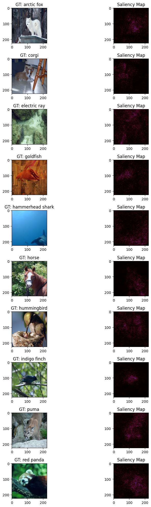
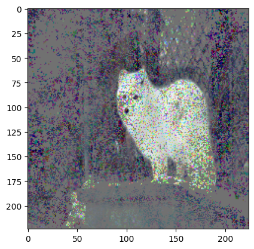
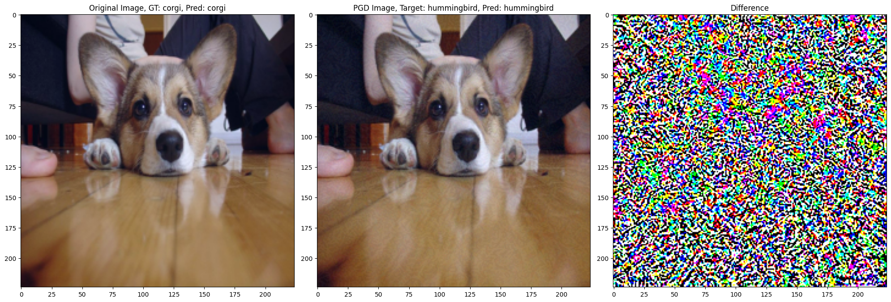
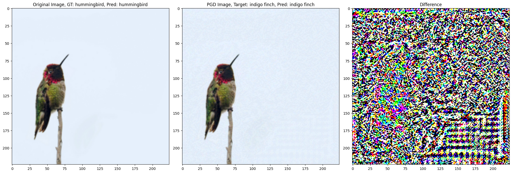
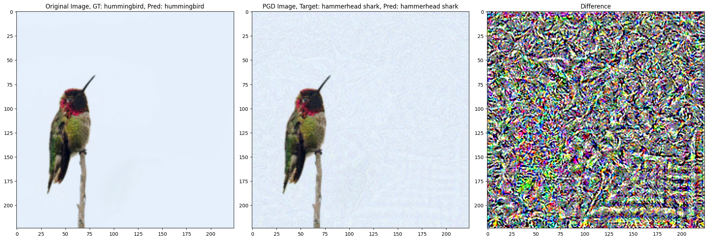

# Exploring CNNs: Saliency Maps and Adversarial Attacks

This project explores the inner workings and vulnerabilities of a pre-trained ResNet-18 convolutional neural network. The primary goals are to understand model interpretability and test its robustness. This is achieved through two main experiments:

1.  **Network Visualization:** Generating saliency maps to visualize which parts of an image the model focuses on for classification.
2.  **Adversarial Attacks:** Crafting subtle, human-imperceptible noise to fool the network into making incorrect predictions.


This project was developed based on an assignment for the Computer Vision course at IIITH. This README is mostly LLM generated. Please see the `ipynb` files in `notebooks/` instead.

## Key Features

*   **Saliency Map Generation:** Implementation of a gradient-based method to highlight important image pixels for a given classification.
*   **Saliency-Based Analysis:** Masking images based on saliency scores to test the model's performance on partial information.
*   **Adversarial Attack Implementation:** An iterative, gradient-based attack (similar to PGD) to generate adversarial examples.
*   **Attack Strategy Comparison:** Analysis of attacks targeting the "second most probable" class versus the "least probable" class.

## Project Structure

The repository is organized as follows:

```
.
├── data/
│   └── network_visualization/ (each folder has images of the corrersponding class)
│       ├── arctic_fox/
│       ├── corgi/
│       └── ... (other class folders)
├── notebooks/ (contains pdf and ipynb files)
├── assets/ (images for readme)
├── network_visualization.pth (the model used)
└── README.md
```

---

## Methodology and Examples

### Part 1: Network Visualization with Saliency Maps

To understand what the ResNet-18 model "sees," we generate saliency maps. These maps are heatmaps that highlight the pixels in an input image that were most influential in determining the model's final prediction.

#### Implementation

The saliency map is computed by calculating the gradient of the score for the correct class with respect to the input image pixels. The process is as follows:

1.  A pre-processed image is passed to the model.
2.  We enable gradient calculation for the input image tensor (`img.requires_grad_(True)`).
3.  A forward pass is performed to get the output logits.
4.  The loss is calculated between the logits and the ground-truth label.
5.  A backward pass (`loss.backward()`) computes the gradients.
6.  The absolute value of the gradient with respect to the image (`img.grad.abs()`) forms the saliency map, which is then visualized.

#### Results

The saliency maps clearly show that the model learns to focus on the object of interest. For example, in the image of the arctic fox, the model's attention is concentrated on the fox's body and face, ignoring the background fence and snow.


*(Caption: Left: Original images. Right: The corresponding saliency map, where brighter regions indicate higher importance for the model's prediction.)*

#### Analysis with Masked Images

To further test the importance of these salient regions, we conducted an experiment where we masked out the *least* important pixels (those with low saliency scores) and replaced them with zero or Gaussian noise.

The results show that the model is highly sensitive to this change. When a significant portion of the image is replaced by noise, the model often misclassifies the image, even if the main object is still recognizable to a human. For instance, the arctic fox and corgi were both misclassified as "hammerhead shark."

  
*(A masked image where non-salient pixels are replaced with noise. The model misclassified this as a "hammerhead shark.")*

This suggests that while the model focuses on the foreground object, it also relies on background context (or lack thereof). The introduction of noise in the background, which might share statistical properties with images of other classes (like the dark, noisy backgrounds of underwater images), can lead to confident but incorrect predictions.

---

### Part 2: Fooling the Network with Adversarial Attacks

Adversarial attacks demonstrate the fragility of deep neural networks. By adding a carefully crafted, often imperceptible layer of noise to an image, we can cause the model to misclassify it, sometimes with high confidence. This noise is targeted, as adding random gaussian noise does not significantly affect the accuracy of the model. 

#### Implementation

We used an iterative, gradient-based method to generate adversarial examples. Instead of training the network, we freeze its weights and "train" the input image itself.

1.  The input image tensor is made a learnable parameter.
2.  A **target class** is chosen (e.g., the class the model thinks is second-most-probable).
3.  For a set number of steps, we:
    *   Perform a forward pass with the current (noisy) image.
    *   Calculate a loss that we want to *maximize* for the target class. This is equivalent to performing gradient *ascent*.
    *   Compute the gradient of this loss with respect to the image pixels.
    *   Update the image by adding a small amount of this gradient.

The final, modified image is the adversarial example.

#### Results

The attacks were highly effective. The resulting images are nearly indistinguishable from the originals to the human eye, yet they completely fool the model. The "Difference" image below visualizes the noise that was added, min-max scaled for visibility.


*(Caption: Left: Original image, correctly classified as "corgi." Middle: Adversarial image, misclassified as "hummingbird." Right: The difference between the two images, revealing the adversarial noise.)*

We compared two attack strategies:
1.  **Targeting the Second Most Probable Class:** This is an "easier" attack, as the model is already close to choosing this class. These attacks required very few steps (often just one) and minimal noise.
2.  **Targeting the Least Probable Class:** This is a "harder" attack, requiring the model to be pushed further from its initial prediction. These attacks took more steps and resulted in slightly more visible noise in the "Difference" image.




*(Caption: Targeting the least probable class (bottom) on the hummingbird results in more perceptible change to the background than targeting the second most probable class (top))*

This demonstrates that the amount of perturbation needed is proportional to how "far" we want to push the model's decision boundary.

## Conclusion

This project provided key insights into the behavior of a ResNet-18 model:
*   **Interpretability:** Saliency maps confirm that CNNs learn to identify relevant features in an image, but they also show that background context and non-obvious patterns influence their decisions.
*   **Robustness:** The high success rate of adversarial attacks highlights a critical vulnerability in deep learning models. Visually imperceptible changes can lead to a complete failure in classification, raising security concerns for real-world applications.
